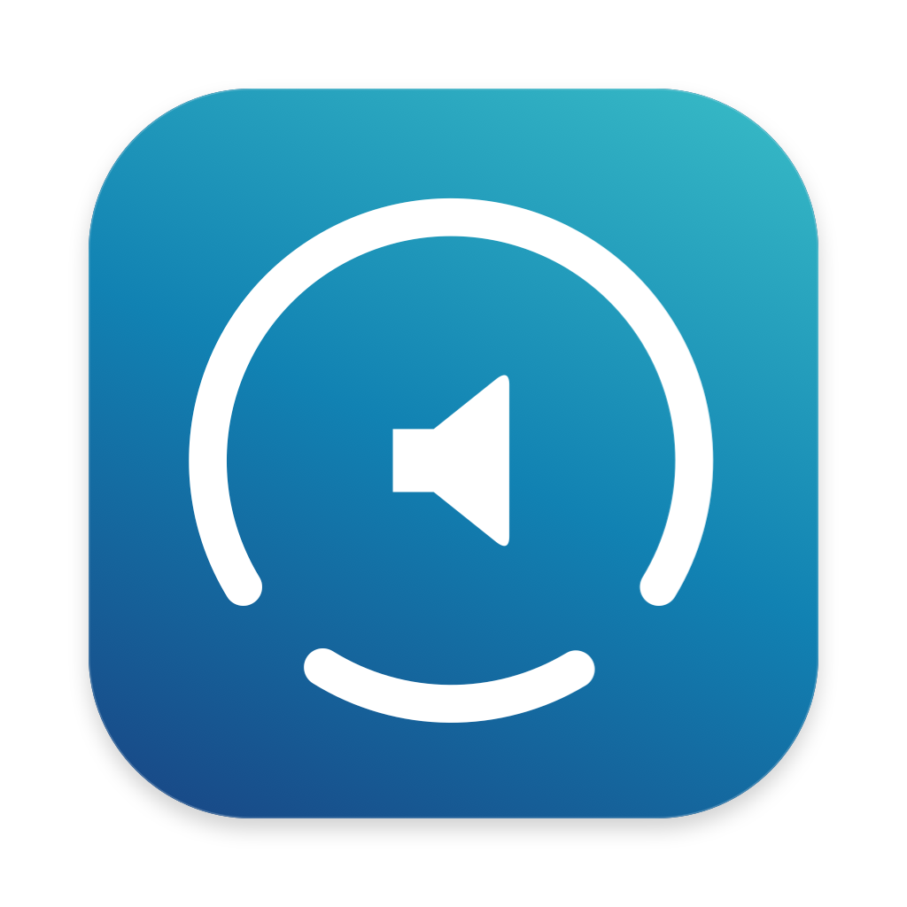
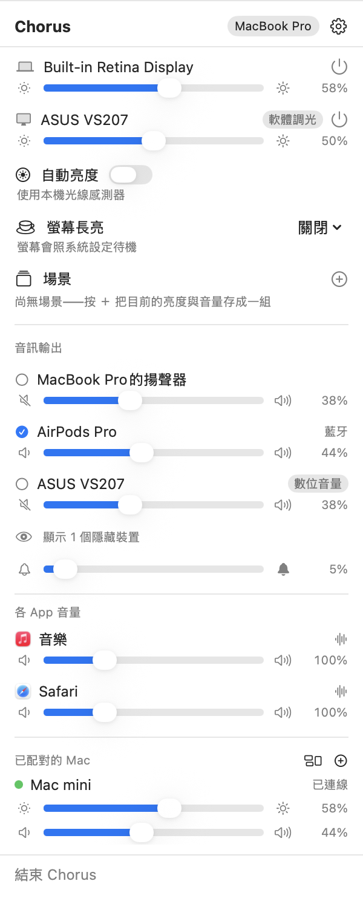
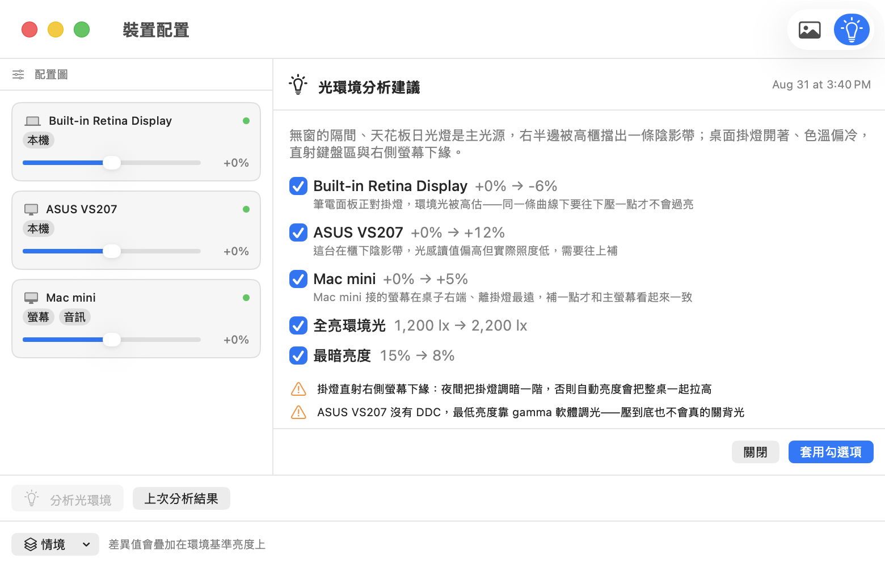
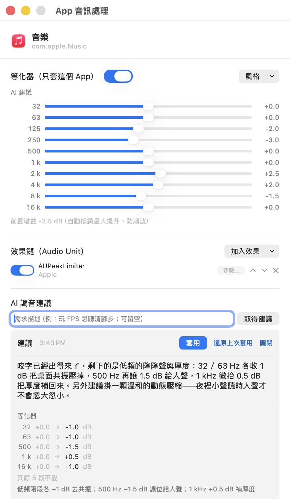
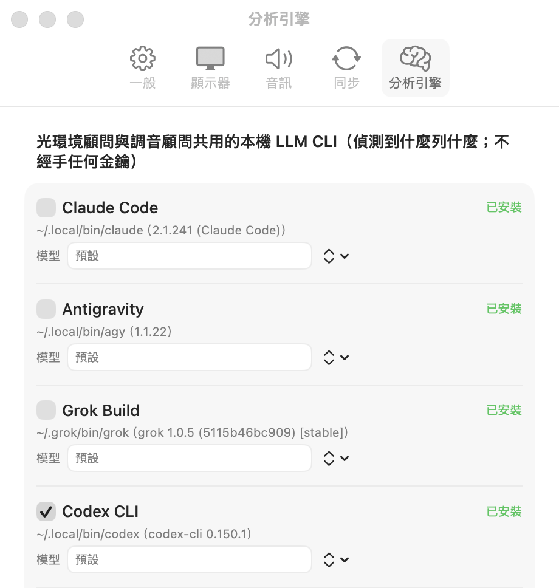

# Chorus



[繁體中文](README.md) | [English](README.en.md)

Chorus puts display brightness and per-app audio in one menu bar, then adds
LAN multi-Mac sync and remote control across the machines on your desk. Two AI
advisors ride along: one turns a desk photo into a lighting plan, the other
recommends EQ and AU effects from a text goal, both through AI CLIs you already
subscribe to. Chorus never holds an API key.

> **One app for Lunar-class brightness and SoundSource-class per-app audio.
> Peer sync with no cloud and no accounts. AI lighting and EQ that use only
> your existing CLI subscriptions.**

`1.5.1` (build 88) · macOS 26+ · Apple Silicon · Traditional Chinese / Simplified Chinese / English



*Menu bar: this Mac's displays, audio devices, and per-app volumes. Below them,
another Mac on the same desk. Brightness and volume stay in sync, and you can
drag its sliders from here.*


**The app and the menu bar share one mark; the icon is the status.** The outer
ring (a 280° gauge opening downward) is main-display brightness. The center
reuses the system Sound menu vocabulary for the current default output: built-in
speakers draw that Mac, HDMI / DisplayPort draw a display, AirPods draw AirPods,
AirPlay draws AirPlay, with a slash when muted. Ordinary speakers, USB, and
virtual devices keep a hand-drawn speaker glyph whose two sound waves light by
volume step; mute becomes an X.
A short bar at the bottom lights for keep-awake, a double dot for a focus
countdown; when neither is active the bar fades.
The right side shows the sooner of keep-awake / focus countdown, with a bottom
mark for which kind; ∞ when keep-awake is on with no countdown; otherwise only
the icon.

The app icon uses a blue-green gradient with a white mark; the menu bar uses the
system's automatic template (monochrome) version.
Run `scripts/render-icons.sh` to regenerate `.icns`, PNG, and the
[light/dark and status previews](assets/icon-design.png) from the menu-bar
drawing program.

---

## ① Treat a desk of Macs as one

Adjust brightness or volume on any paired machine and the others follow in the
same instant, or target one machine alone. No cloud, no accounts: peers find
each other on the LAN, confirm with a one-time PIN, then talk over end-to-end
encryption.

- **Pairing**: automatic discovery on the same LAN, confirmed with a one-time
  PIN. After that, traffic is end-to-end encrypted; unpaired machines are
  refused. No cloud, no accounts. Proven with 2–5 Macs.
- **What syncs**: display brightness, output volume and mute (each with its own
  switch), and ambient-light readings. Simultaneous tweaks on two machines do
  not fight.
- **Remote only, not synced**: display power, input source, contrast,
  keep-awake, per-app volume and mute: these are actions, not shared state. The
  menu bar can expand any peer's displays and audio devices, so shutting off
  the screen across the desk does not mean walking over.
- **Cross-Mac ambient light**: a Mac with a light sensor is the reference;
  Macs without one (Mac mini) follow it for auto-brightness. If the reference
  drops offline, another takes over. Closing a laptop lid does not make
  displays flicker.
- **Schedule fallback**: when no sensor is available (solo Mac mini, laptop
  closed and all peers offline), estimate ambient light from day/night
  windows: how bright by day, how bright at night, when dawn and dusk fall,
  each with a half-hour smooth ramp. Dawn and dusk can instead follow local
  sunrise/sunset. Real sensor readings immediately take over.

```bash
chorus set --peer "Mac mini" --all-displays --power off
chorus set --peer "Mac mini" --app com.spotify.client --mute on
```

---

## ② One desk photo → an actionable lighting plan

Photograph your desk setup. The model reads the lighting and returns suggestions
you apply item by item.

1. In the **device layout** window, import a desk photo and drag each display
   node onto its place in the image.
2. Press **Analyze lighting**. Along with the photo, Chorus sends each
   display's current settings and recent ambient-light readings.
3. You get a checklist: **per-display brightness offsets**, two ambient-light
   curve parameters, plus warnings that cannot be applied automatically, each
   with a short reason.
4. **Nothing applies until you check it.** After apply, one click restores.
   The last 5 analyses stay available to review.



*Suggestions are checkable item by item: per-display offsets, curve parameters,
and warnings that cannot auto-apply. Paired Macs are part of the analysis
(third item above). The advice text in the screenshot is sample data, not a
real model response.*

---

## ③ One sentence goal → EQ and AU recommendations

The same flow on the audio side. Pick a target (an app or an output device) and
say what you want in one line:

> "FPS footsteps clearer" · "Podcast vocals more present"

- Only text goes out: who the target is, your goal, the **AU list actually
  scanned on this Mac**, and the current EQ and effect chain. **No audio
  content is sent.**
- The model may pick only from that list; anything else is dropped, so nothing
  appears that is not installed.
- The result card lists "now → suggested" per section with reasons. **Nothing
  takes effect until you press Apply**; you can restore afterward.



*One window per app: EQ (scoped to that app), AU effect chain, and at the
bottom the advice card: section by section "now → suggested," live only after
Apply. Advice text is likewise sample data.*

### AI engines: zero keys, your own subscriptions

Both advisors and UI translation share one engine set. Chorus **never handles
an API key**. It calls AI CLIs already signed in on this Mac, and billing stays
on your existing subscriptions. Whichever CLIs are detected appear in Settings:

| CLI | Display name |
|---|---|
| `claude` | Claude Code (default) |
| `agy` | Antigravity |
| `grok` | Grok Build |
| `codex` | Codex CLI |
| `opencode` | OpenCode |
| `pi` | Pi |



Analysis is an **explicit action** (button-triggered, with a confirmation
dialog the first time). Nothing is sent in the background.

---

## UI language: three built-in, anything else you translate

Chorus ships **Traditional Chinese, Simplified Chinese, and English**. It
follows the system language by default, or you can pin one under
Settings → General → UI Language (takes effect after relaunch). When the system
is some other language, the same menu can hand **all UI strings to the same AI
CLI set for translation**:

- The source is the built-in English catalog (including plural forms). Only
  Chorus's own UI strings go out, never your data. Batches of 40 usually finish
  in a few minutes; each batch lands immediately, so canceling mid-run keeps
  finished work.
- Translated files live only on this Mac
  (`~/Library/Application Support/Chorus/UITranslations/`) and apply after
  relaunch. The **three built-in languages always stay at the top** of the
  menu; switch back anytime; translation files are not deleted.
- Every format specifier is validated line by line; broken lines fall back to
  English instead of rendering garbage. Strings added in an app update show
  English until you backfill; Settings prompts "Translate N new strings."

This is machine translation, and the UI says so. The three built-in catalogs
do not use this path; they ship signed with the app.

---

## Equalizer and effect chain

- **Equalizer**: one set per output device and per app. Manual 10-band,
  **21 style presets**, or [AutoEq](https://github.com/jaakkopasanen/AutoEq)
  headphone correction (common models built in; paste a correction file too).
  Boosted bands get automatic pre-attenuation so you do not clip.
- **AU effects**: Audio Unit effects on a per-app chain and a device-level
  chain, with a live parameter panel. **Only Apple's built-in macOS effects**
  (AUDynamicsProcessor, AUMatrixReverb, and twenty-odd others); third-party
  plugins are out of scope and never appear in the list.
- If a plugin takes the app down on load, the next launch marks it
  **quarantined** and skips auto-load: worst case one crash, not every boot.

---

## Everything else

### Display

- **Brightness**: external displays use DDC/CI for real backlight; built-in
  panels and Apple displays use the system path; displays without DDC fall
  back to software dimming. The bottom 25% of the slider also uses software
  dimming: external hardware floors are often still too bright at night.
- **Auto-brightness**: follows ambient light. Dark-end and full-bright ambient
  points on the curve are adjustable; each display can take its own offset or
  opt out.
- **Display power**: one power button truly turns off built-in and external
  panels (path chosen by capability).
- **Input source**, **contrast**, **keep-awake** (30 min / 1 hour / indefinite /
  while a display is connected / while an app is running / under high load;
  bindings clear when the display unplugs or the app quits, and restore when
  they return).
- **Agent mode**: keep the Mac awake only while an AI agent is working, then
  release. It watches Claude Code and Codex session-log mtimes (mtime only,
  never contents). A process sitting at a prompt does not count. This blocks
  **system** sleep, not display sleep: overnight runs need the machine up;
  a dark screen is fine.
- **High-load mode**: keep the display awake only after CPU / GPU / network
  stay above threshold (default 15 s); clear after 120 s under the sustain
  floor. Thresholds are adjustable in Settings; when GPU is unreadable the
  mode degrades cleanly and CPU / network still work. Menu choices persist
  across relaunch; automation / peer numeric commands change runtime only,
  not saved prefs.
- **Emergency recovery**: press ⌘ eight times within 3 seconds to bring every
  powered-off display back, so you cannot lock yourself into a black screen.
- **Media-key takeover**: only when macOS cannot handle the key natively
  (volume on display speakers, brightness on machines with no built-in panel);
  everything else stays native.

### Audio

- **Devices**: volume / mute / default-device switching, L/R balance, device
  priority (preferred headphones become default on connect and restore last
  volume), alert volume separate from output volume.
- **Per-app** (**off by default**; needs system audio capture permission when
  enabled): independent volume (up to 400%), mute, and output routing per app.
  Settings stick to the app and restore on relaunch. Put apps on an
  **exclusion list** and Chorus leaves them alone. Untouched apps stay on the
  native path; Chorus never intercepts them.
- **Virtual output device** (one-click install in Settings): DP/HDMI display
  speakers have no system volume, so macOS disables volume keys and Control
  Center. Set the virtual device as default and volume UI returns; DDC-capable
  displays get hardware volume (no quality loss), others get software
  attenuation.
- Without permission, per-app and EQ hide as a group; device volume, brightness,
  and sync are unaffected.

### Settings backup and diagnostics

- **iCloud Drive backup** (off by default): settings, scenes, EQ, and effect
  chains as plain-text JSON in your own iCloud Drive: one write-only copy per
  machine. On a new Mac, pick a source in Settings to import; hardware-bound
  items (pairing keys, device UIDs) are skipped automatically. Never through
  our servers.
- **Diagnostic log**: `~/Library/Logs/Chorus/chorus.log` (2 MB per rotation,
  three kept). Device plug/unplug, default-output changes, scene apply/restore,
  and every step of app-audio takeover land here. When sound or picture goes
  wrong, attach this file with the time it happened. Settings has "Reveal in
  Finder."

### Command line and automation

The `chorus` CLI ships inside the app; Settings installs it to `/usr/local/bin`
in one click (no admin password). Homebrew installs already link it onto PATH.
The same semantics are also available over localhost HTTP (off by default;
enable in Settings; bound to `127.0.0.1` only, token required).

```bash
chorus set --brightness 50%
chorus set --display-like DELL --brightness +10%
chorus set --app com.apple.Music --volume 40%
chorus scene 電影
chorus scene 工作 --for 25m # timed scene: auto-restore when time is up
chorus scene --end          # end early and restore
chorus listen | jq          # event stream of state changes
chorus doctor               # check permissions, discovery, peer connections and audio, with fixes
```

**Scenes**: named action sets ("電影" = all displays 30% + output volume 20%).
The menu bar, `chorus scene <name>`, and HTTP all hit the same definitions.

**Timed scenes** (`--for`): before apply, remember every value the scene will
touch; when time is up, put them back. Ending early and quitting Chorus share
the same restore path. Scope follows scene contents, so only what we moved is
restored; manual tweaks elsewhere in those 25 minutes stay put. Input-source
switches cannot read back (action-style VCP) and are listed honestly under
"will not auto-restore."

---

## Install

With [Homebrew](https://brew.sh):

```bash
brew install gixiphy/tap/chorus     # installs Chorus.app and the chorus CLI
brew upgrade --cask chorus           # later updates
```

Or download the zip from [Releases](https://github.com/gixiphy/Chorus/releases),
unzip, and drag `Chorus.app` into Applications.

The virtual audio device (HAL driver) is not installed automatically either
way. Open Chorus, then Settings → Install Driver (admin password required).
`brew uninstall --cask chorus` removes the driver too.

**Not on the Mac App Store**: brightness and display power need private APIs
and an unsandboxed build, so releases ship Developer ID signed and Apple
notarized.

Build from source:

```bash
xcodegen generate        # produces Chorus.xcodeproj (.xcodeproj is not in VCS)
open Chorus.xcodeproj
```

`./scripts/package.sh` bumps the build number, runs a Release archive,
re-signs with Developer ID, verifies the signature, and writes a zip. If
notarytool credentials are stored locally
(`xcrun notarytool store-credentials chorus …`), it also notarizes, staples,
and Gatekeeper-checks. Any failed gate aborts with no half-built artifact.

When Keychain holds multiple Developer ID Application certificates with the
same name (old not deleted, new just renewed), the script stops and asks which
to use. Grab the fingerprint with
`security find-identity -v -p codesigning`, then:

```bash
CHORUS_SIGN_IDENTITY=<40-char SHA-1 fingerprint> ./scripts/package.sh
```

Release: `./scripts/release.sh --package --version 1.12.0` packages, notarizes,
git-tags, creates the GitHub Release (uploads the zip), updates the
[Homebrew tap](https://github.com/gixiphy/homebrew-tap) cask (version and
sha256), and finishes with `brew fetch` verification. Omit `--package` if the
zip already exists; `--dry-run` prints commands only.

Pure logic lives in `Packages/ChorusCore`;
`cd Packages/ChorusCore && swift test` runs without touching hardware.

### Crash reporting

Chorus sends nothing off this Mac. Crash / hang evidence stays in
`~/Library/Logs/Chorus/diagnostics/` (MetricKit diagnostics + system `.ips`
summaries, up to 20). Settings ▸ Diagnostics ▸ "Export diagnostics…" zips one
for an issue. `scripts/package.sh` keeps each build's dSYMs under
`dist/dsyms/`. After a report:

```bash
python3 scripts/symbolicate-diagnostics.py <unzipped diagnostics/xxx-crash.json> --dsym dist/dsyms/Chorus-<version>-b<build>.dSYMs.zip
```

## Known issues

- **Local Network permission** (macOS 15+): if denied, sync fails silently. If
  Chorus is missing from the System Settings list, a reboot usually fixes it
  (known macOS issue). The menu bar shows troubleshooting hints.
- M1-era Mac mini built-in HDMI has no DDC; some USB-C→HDMI adapters also do
  not pass it through; those cases fall back to software dimming automatically.
- AU plugins that crash mid-playback cannot be caught (industry status quo);
  quarantine only guarantees you will not crash on every launch.
- In "mirror display hardware volume" mode, L/R balance on the virtual output
  does not apply (the UI warns).

## License

- `Chorus/Display/Vendor/AppleSiliconDDC.swift` is vendored from
  [waydabber/AppleSiliconDDC](https://github.com/waydabber/AppleSiliconDDC)
  (MIT).
- Equalizer headphone-correction data comes from
  [AutoEq](https://github.com/jaakkopasanen/AutoEq) (MIT); biquad coefficient
  formulas from the public Audio EQ Cookbook (Robert Bristow-Johnson). Style
  preset curves are original.
- `AudioDriver/` is based on
  [proxy-audio-device](https://github.com/briankendall/proxy-audio-device)
  (Unlicense).
