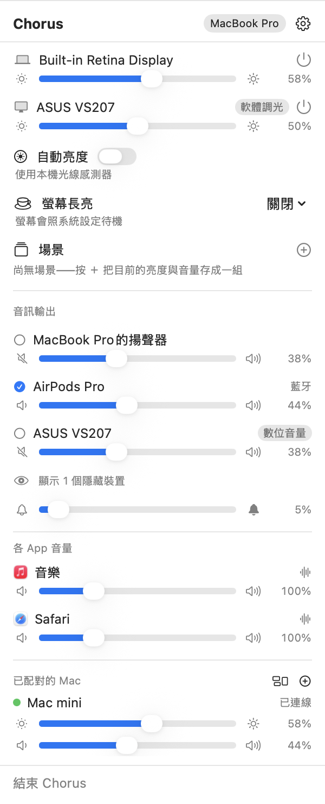
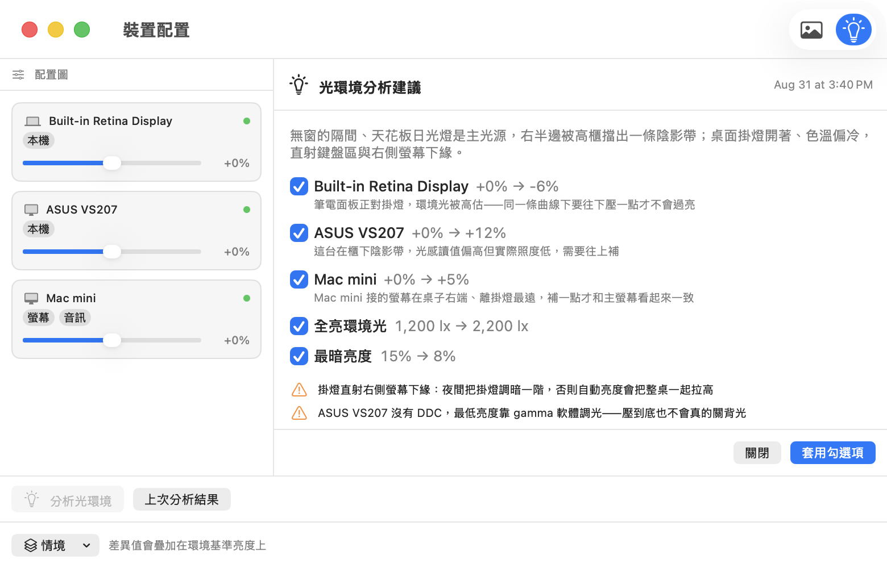
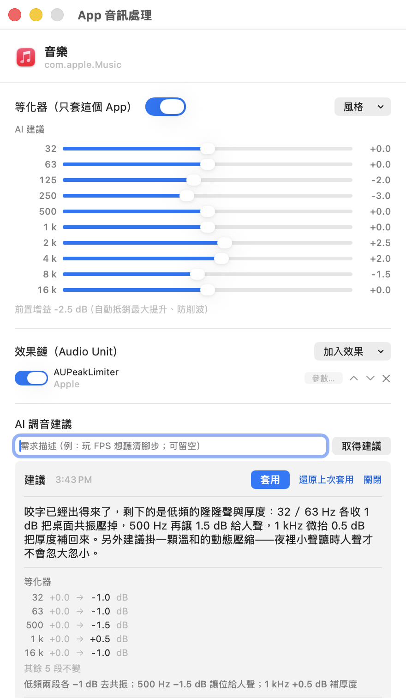
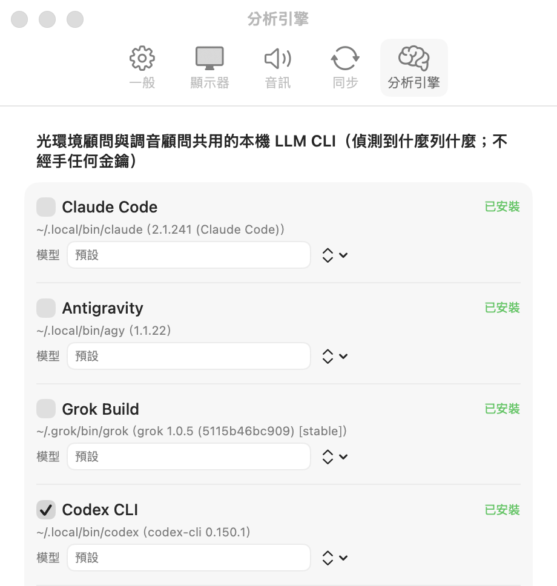

# Chorus

macOS 選單列 App：控制所有螢幕與音訊裝置——並且在同一區網的多台 Mac 之間
**即時同步、互相遙控**。內建兩位 AI 顧問：一位看桌面照片給調光策略，
一位替 App 與輸出裝置推薦 **EQ 與 AU 效果**。

> 亮度控制的參考點是 [Lunar](https://lunar.fyi)，per-app 音訊是
> [SoundSource](https://rogueamoeba.com/soundsource/) 那一類。Chorus 把兩邊收進
> 同一個選單列，再疊上跨機與 AI 這兩層——那才是它真正的差異點。

`1.1.0`（build 63）· macOS 26+ · Apple Silicon



*選單列：本機的螢幕、音訊裝置與各 App 音量，最下面是同一張桌上的另一台 Mac——
亮度與音量在兩台之間即時同步，也可以直接從這裡拉它的滑桿。*


**圖示本身就是狀態**：外環（開口朝下的 270° 量表）是主顯示器亮度、中心三根聲波柱
是預設輸出音量（靜音時塌成一條橫線）、右側文字是螢幕長亮的倒數（無限期與
「接著這台螢幕時」顯示 ∞）。沒在防睡眠時不顯示倒數，圖示也就窄一格。

---

## ① 跨設備同步與遙控

一組 Mac 當成一台用。在任一台調亮度或音量，其他配對的機器同一瞬間跟上；
也可以只針對某一台下指令。

- **配對**：同一區網自動找到彼此，用一次性 PIN 確認就完成。之後走端對端加密連線，
  沒配對過的機器一律拒絕。無雲端、無帳號，2–5 台實測。
- **會同步的**：螢幕亮度、輸出音量與靜音（兩者各有獨立開關）、環境光讀值。
  兩台同時調也不會打架。
- **只遙控、不同步的**：螢幕電源、輸入源、對比、防睡眠、逐 App 音量與靜音——
  這些是「動作」而不是該兩台一致的狀態。選單列可以直接展開任一台的螢幕與音訊裝置，
  「把桌子另一頭那台的螢幕關掉」不必走過去。
- **跨機環境光**：有光線感測器的 Mac 當基準，沒有的跟著它走——Mac mini 這種沒光感的
  機器也能有自動亮度。基準來源斷線會自動接手，闔上筆電不會讓螢幕忽明忽暗。

```bash
chorus set --peer "Mac mini" --all-displays --power off
chorus set --peer "Mac mini" --app com.spotify.client --mute on
```

---

## ② AI 光環境顧問：照片 → 調光策略

拍一張桌面佈置的照片，讓模型看懂你的光環境，回一份可逐項套用的調光建議。

1. 在**裝置配置圖**視窗匯入桌面照片，把螢幕節點拖到照片上對應的位置。
2. 按「分析光環境」。連同照片送出的還有每台螢幕現在的設定與近期的環境光讀值。
3. 回來的是一份建議清單：**每台螢幕的亮度差異值**、環境光曲線的兩個參數，
   外加不能自動處理的警告，每一項都附一句理由。
4. **逐項勾選才套用**，套用後可一鍵還原。最近 5 次分析留著可回看。



*建議逐項可勾選：每台顯示器的差異值、曲線參數，加上不能自動套用的警告。
已配對的 Mac 也是分析對象之一（上圖第三項）。截圖中的建議內容是示範資料，
不是某次真實模型輸出。*

「家」與「公司」可各存一份**桌面情境**（配置圖＋照片＋曲線＋差異值），
接上同一組螢幕時自動切換。

---

## ③ AI 調音顧問：EQ 與 AU 推薦

同一套流程搬到音訊側。選一個目標（某個 App 或某台輸出裝置），用一句話說你要什麼——

> 「玩 FPS 想聽清腳步」「Podcast 人聲清楚一點」

- 送出的只有文字：目標是誰、你的需求、**本機實際掃描到的 AU 清單**，以及現在的
  等化與效果鏈。**不送任何音訊內容。**
- 模型只能從那份清單裡挑外掛，挑不在清單裡的會被丟掉——不會冒出你機器上沒有的東西。
- 結果卡逐段列出「現在 → 建議」與理由，**不會自動生效**；按「套用」才寫入，可還原。



*一個 App 一個視窗：等化器（只套這個 App）、AU 效果鏈，最下面是建議卡——
逐段列出「現在 → 建議」，按下「套用」才會生效。建議內容同樣是示範資料。*

### 分析引擎：零金鑰，用你自己的訂閱

兩位顧問共用一組引擎。Chorus **不經手任何 API key**——它呼叫你本機已經登入的
LLM CLI，計費走你既有的訂閱。偵測到哪幾家就在設定頁列哪幾家：

| CLI | 顯示名稱 |
|---|---|
| `claude` | Claude Code（預設） |
| `agy` | Antigravity |
| `grok` | Grok Build |
| `codex` | Codex CLI |
| `opencode` | OpenCode |



分析是**顯式動作**（按鈕觸發，首次有確認對話框），不在背景送任何東西。

---

## 等化器與效果鏈

- **等化器**：每台輸出裝置、每個 App 各一組。手動 10 段、**21 條風格 preset**，
  或 [AutoEq](https://github.com/jaakkopasanen/AutoEq) 耳機校正（內建常見型號、
  也可貼上校正檔）。抬高頻段時自動配上前置衰減，不會破音。
- **AU 效果**：掛上本機的 Audio Unit 外掛，per-app 與裝置層各一條鏈，
  參數面板即時可聽。
- 外掛在載入時把 App 帶掛的話，下次啟動會被標成**已隔離**、不再自動載入——
  最壞只崩一次，不會每次開機都崩。

---

## 其餘功能

### 顯示

- **亮度**：外接螢幕走 DDC/CI 直接調背光；內建面板與 Apple 顯示器走系統路徑；
  螢幕不支援 DDC 時自動改用軟體調光。滑桿下段 25% 也走軟體調光——外接螢幕的
  硬體最低亮度常常還是太亮，夜裡可以再往下壓。
- **自動亮度**：跟著環境光走，曲線的最暗亮度與全亮環境光可調，每台螢幕可各給
  一個差異值，也可以逐台退出。
- **螢幕電源**：一顆電源鈕，內建面板與外接螢幕都能真的關掉（依螢幕能力自動選路徑）。
- **輸入源切換**、**對比**、**防睡眠**（30 分鐘／1 小時／無限期／接著某台螢幕）。
- **緊急復原**：3 秒內連按 8 次 ⌘ 把所有關掉的螢幕接回來，不會把自己鎖在黑屏裡。
- **媒體鍵接管**：只在 macOS 原生處理不了時接手（螢幕喇叭的音量鍵、沒有內建螢幕
  機器的亮度鍵），其餘按鍵維持原生行為。

### 音訊

- **裝置**：音量／靜音／預設裝置切換、左右平衡、裝置優先順序（偏好的耳機一接上
  就成為預設並還原上次音量）、提示音音量與輸出音量分開。
- **逐 App**（**預設關閉**，開啟時需要系統音訊錄製權限）：各 App 獨立音量
  （最高 400%）、靜音與輸出路由，設定記在 App 上、重開自動恢復。
  可以把某些 App 放進**排除清單**，Chorus 完全不碰它們。
  沒調整過的 App 走原生路徑，不經過 Chorus。
- **虛擬輸出裝置**（設定頁一鍵安裝）：DP/HDMI 螢幕喇叭沒有系統音量，macOS 會停用
  音量鍵與控制中心。把虛擬裝置設為預設輸出後，音量 UI 全部恢復；支援 DDC 的螢幕
  直接調硬體音量（不損音質），其餘用軟體衰減。
- 沒給權限時，逐 App 與等化整組隱藏；裝置音量、亮度、同步完全不受影響。

### 命令列與自動化

`chorus` CLI 內嵌在 App 裡，設定頁一鍵安裝到 `/usr/local/bin`（不需要管理員密碼）。
同一套語意也開在 localhost HTTP 上（預設關閉，設定頁開啟，只綁 `127.0.0.1` 並要 token）。

```bash
chorus set --brightness 50%
chorus set --display-like DELL --brightness +10%
chorus set --app com.apple.Music --volume 40%
chorus scene 電影
chorus listen | jq          # 狀態變動的事件流
```

**場景**：一組具名的動作（「電影」＝全部螢幕 30% ＋ 輸出音量 20%）。
選單列、`chorus scene <名稱>` 與 HTTP 觸發的是同一份。

---

## 安裝

到 [Releases](https://github.com/gixiphy/Chorus/releases) 下載 zip，解壓後把
`Chorus.app` 拖進「應用程式」。

**上不了 Mac App Store**：亮度與螢幕電源用到 private API，也必須關掉 sandbox，
所以以 Developer ID 簽章＋Apple 公證直接發行。

自行建置：

```bash
xcodegen generate        # 產生 Chorus.xcodeproj（.xcodeproj 不進版控）
open Chorus.xcodeproj
```

`./scripts/package.sh` 會遞增 build 號、跑 Release archive、以 Developer ID 重簽、驗簽並產出 zip；
本機存好 notarytool 憑證（`xcrun notarytool store-credentials chorus …`）的話會一併送公證並 staple。

純邏輯集中在 `Packages/ChorusCore`，`cd Packages/ChorusCore && swift test` 不碰硬體就跑得完。

## 已知事項

- **區域網路權限**（macOS 15+）：被拒時同步會靜靜失效。若系統設定的清單裡沒有
  Chorus，重新開機通常可修復（已知的 macOS 問題）。選單列會顯示疑難排解提示。
- M1 世代 Mac mini 的內建 HDMI 埠沒有 DDC；部分 USB-C→HDMI 轉接器也不透傳——
  這些情況會自動改用軟體調光。
- AU 外掛在播放途中崩潰擋不住（業界現狀），隔離機制只保證不會每次啟動都崩。
- 虛擬輸出裝置在「鏡射螢幕硬體音量」模式下，左右平衡不生效（介面上有提示）。

## 授權

- `Chorus/Display/Vendor/AppleSiliconDDC.swift` vendored 自
  [waydabber/AppleSiliconDDC](https://github.com/waydabber/AppleSiliconDDC)（MIT）。
- 等化器的耳機校正資料來自 [AutoEq](https://github.com/jaakkopasanen/AutoEq)（MIT）；
  biquad 係數公式取自公開的 Audio EQ Cookbook（Robert Bristow-Johnson）。
  風格 preset 的曲線為自行編寫。
- `AudioDriver/` 底本為
  [proxy-audio-device](https://github.com/briankendall/proxy-audio-device)（Unlicense）。
